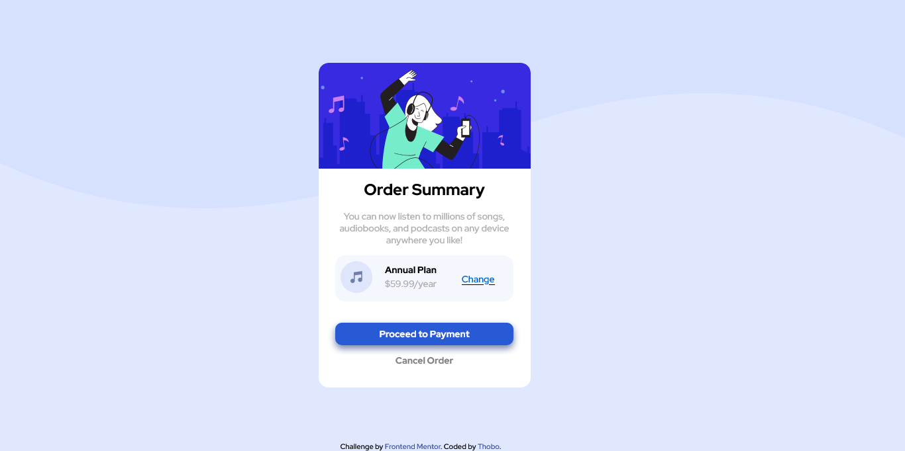

# Frontend Mentor - Order summary card solution

This is a solution to the [Order summary card challenge on Frontend Mentor](https://www.frontendmentor.io/challenges/order-summary-component-QlPmajDUj). Frontend Mentor challenges help you improve your coding skills by building realistic projects. 

## Table of contents

- [Overview](#overview)
  - [The challenge](#the-challenge)
  - [Screenshot](#screenshot)
  - [Links](#links)
- [My process](#my-process)
  - [Built with](#built-with)
  - [What I learned](#what-i-learned)
  - [Continued development](#continued-development)
  - [Useful resources](#useful-resources)
- [Author](#author)

## Overview

### The challenge

Users should be able to:

- See hover states for interactive elements

### Screenshot

#### Desktop design



#### Mobile design


### Links

- Solution URL: [Thobo-Gaboipewe/order-summary-component-main](https://github.com/Thobo-Gaboipewe/order-summary-component-main)
- Live Site URL: [Add live site URL here](https://your-live-site-url.com)

## My process

### Built with

- Semantic HTML5 markup
- Flexbox
- CSS Grid
- Mobile-first workflow

### What I learned

```css
body {
        background-image: url('images/pattern-background-desktop.svg');
        background-size: cover;
        background-position: 50% 20%;
        background-repeat: no-repeat;
    };
```
### Continued development

I would like to focus more on backend development before progressing to full stack development.

### Useful resources

- [Mozilla Developer Network](https://developer.mozilla.org/en-US/docs/Web/CSS) - This helped me position the background image.
- [Modern CSS Master the Key Concepts of CSS for Modern Web Development by Joe Attardi](https://link.springer.com/book/10.1007/978-1-4842-6294-8) - This is an amazing book which helped me finally understand the flexbox layout. I'd recommend it to anyone still learning this concept.

## Author

- Frontend Mentor - [@Thobo-ops](https://www.frontendmentor.io/profile/Thobo-ops)
